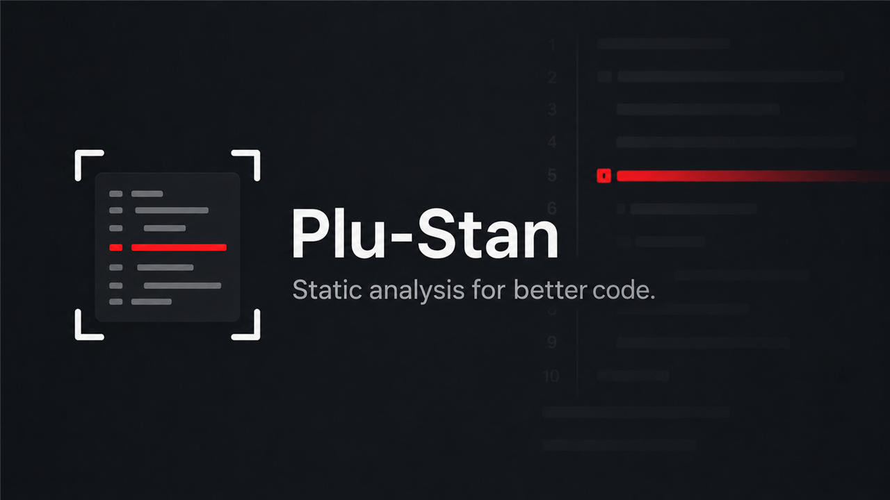

# Plu-Stan



[](https://github.com/input-output-hk/plu-stan/actions)
[](https://github.com/kowainik/stan/blob/main/LICENSE)

Plu-Stan is a [Plinth](https://github.com/input-output-hk/plutus) **ST**atic **AN**alysis tool based on the [Stan](https://github.com/kowainik/stan) static analysis tool.

> ⚠️ Note: Plu-Stan is currently a Proof of Concept (PoC) and is not yet ready for production use. It is being actively developed and improved.


## Table of Contents

- [Plu-Stan](#plu-stan)
  - [Table of Contents](#table-of-contents)
  - [What this tool is about](#what-this-tool-is-about)
  - [Rules](#rules)
    - [Coverage of the Cardano CWE research rules](#coverage-of-the-cardano-cwe-research-rules)
  - [Usage](#usage)
    - [Building \& Running](#building--running)
    - [Running tests](#running-tests)
    - [Haskell language server integration](#haskell-language-server-integration)
  - [Contributing](#contributing)
## What this tool is about

[[Back to the Table of Contents] ↑](#table-of-contents)

Plu-Stan is a static analysis tool for Cardano Smart Contracts written in Plinth. It is based on the [Stan](https://github.com/kowainik/stan) static analysis tool.
The goal of the project is to help Plinth developers to write better code by providing meaningful insights and suggestions on how to improve it, both in terms of code security and performance.

Plu-Stan design and implementation is based on Stan. On top of that, Plu-Stan has its own goals and objectives that are:

- Catch common security issues in Plinth code
- Suggest performance improvements specific to Plinth
- Provide meaningful recommendations and solutions to the problems found
- Help beginners to learn best practices in an easy and informative way

## Rules

[[Back to the Table of Contents] ↑](#table-of-contents)

On top of all the rules provided by Stan, Plu-Stan implements its own set of rules specific to Plinth. The rules are divided into the following categories:
- **Security**: rules that catch common security issues in Plinth code.
- **Performance**: rules that suggest performance improvements specific to Plinth.

So far, Plu-Stan implements the following automated detection rules:

| ID          | Name                                                    | Severity    | Description |
|-------------|------------------------------------------------------|-------------|-------------|
| PLU-STAN-01 | Signature verification builtin usage must satisfy invariants | Warning | Using `verifyEd25519Signature`, `verifyEcdsaSecp256k1Signature`, or `verifySchnorrSecp256k1Signature` requires direct on-chain verification of message hash correspondence and replay prevention mechanisms |
| PLU-STAN-02 | Usage of `unsafeFromBuiltinData` | Performance | Using `unsafeFromBuiltinData` without integrity checks can lead to unbounded datum spam attacks |
| PLU-STAN-03 | Usage of Optional types in on-chain code | Warning     | Using `Maybe` or `Either` types is an anti-pattern; prefer fast-fail variants or continuation functions |
| PLU-STAN-04 | Equality/comparison on PubKeyHash, ScriptHash, or Credential | Warning     | Comparing only credentials (not full addresses) can lead to staking value theft; prefer equality on full `Address` |
| PLU-STAN-05 | Usage of higher-order list helpers | Performance | Higher-order functions like `filter`, `any`, `all`, `find` are inefficient in on-chain code; prefer specialized recursive functions |
| PLU-STAN-06 | Multiple list traversals in on-chain code | Performance | Nested list operations (e.g., `map` over `filter`) cause redundant iterations and increase execution costs |
| PLU-STAN-07 | Guard syntax in on-chain code | Performance | Guard syntax produces inefficient UPLC; prefer `if-then-else` or lower-level conditionals |
| PLU-STAN-08 | Non-strict let binding used multiple times | Performance | Non-strict bindings used multiple times cause repeated evaluation; make bindings strict with bang patterns |
| PLU-STAN-09 | `valueOf` in equality comparisons | Warning     | Using `valueOf` with `adaSymbol` and `adaToken` in comparisons can be unsafe if the token set is unbounded |
| PLU-STAN-10 | Unvalidated hashes from BuiltinData in comparisons | Warning     | Comparing Address/ScriptHash/PubKeyHash/Credential from `unsafeFromBuiltinData` without validating ledger invariants can create unsatisfiable constraints |
| PLU-STAN-11 | Usage of `currencySymbolValueOf` | Warning     | Does not enforce that all token amounts are strictly positive or negative; allows mixed mint/burn in the same transaction |
| PLU-STAN-12 | Validity interval / POSIX time misuse | Warning     | Using validity interval utilities or accessing `txInfoValidRange` without ensuring finite bounds can lead to unbounded time windows |
| PLU-STAN-13 | TxOut validation misses reference script checks | Warning | Validation over `TxOut`/`TxOutAsData` checks several output fields but never constrains the reference script |
| PLU-STAN-14 | TxOut validation misses staking credential checks | Warning | Validation over `TxOut`/`TxOutAsData` checks several output fields but never constrains the staking credential |
| PLU-STAN-15 | TxOut validation misses value checks | Warning | Validation over `TxOut`/`TxOutAsData` checks several output fields but never constrains the output value |
| PLU-STAN-16 | Precision loss: division before multiplication | Warning     | Division before multiplication in integer arithmetic causes precision loss; multiply first, then divide |
| PLU-STAN-17 | Redeemer-supplied indices must be unique | Warning | Selecting list elements by redeemer-supplied index without enforcing uniqueness lets duplicates validate the same element repeatedly |
| PLU-STAN-18 | Avoid lazy `(&&)` in on-chain code | Warning | Lazy `(&&)` in a branching predicate adds delay/force overhead in the generated UPLC; prefer a strict combinator |
| PLU-STAN-19 | TxOut validation misses datum checks | Warning | Validation over `TxOut`/`TxOutAsData` checks several output fields but never constrains the datum |
| PLU-STAN-22 | TxOut validation misses address checks | Warning | Validation over `TxOut`/`TxOutAsData` checks several output fields but never constrains the address, so the output can be paid anywhere |
| PLU-STAN-23 | `unstableMakeIsData` assigns unstable constructor indices | Warning | Constructor indices are positional, so adding or reordering a constructor changes the on-chain encoding and breaks already-locked UTxOs |
| PLU-STAN-24 | Empty string used to detect ADA | Style | An empty-string literal stands in for ADA instead of the dedicated `adaSymbol` / `adaToken` helpers |
| PLU-STAN-25 | Script-input dependency without a redeemer check | Warning | Validation reads the transaction's other script inputs but never inspects a redeemer, so an unrelated co-spend can satisfy it |
| PLU-STAN-26 | `zip` without a length check | Warning | `zip` truncates to the shorter list, so trailing elements of the longer one are silently never validated |
| PLU-STAN-27 | Input spent only to be recreated identically | Performance | An input's address, value, datum and reference script are all asserted equal to an output's — a reference input does this without spending |

For comprehensive guidelines on Plinth security patterns, anti-patterns, and best practices, see the [**Rules Documentation**](./RULES.md). This includes detailed explanations of the above rules plus additional security considerations not yet automated.

### Coverage of the Cardano CWE research rules

[[Back to the Table of Contents] ↑](#table-of-contents)

The inspections above are tracked against the rule set published in
[input-output-hk/Cardano-CWE-Research](https://github.com/input-output-hk/Cardano-CWE-Research/tree/main/rules).
Each row below links to that rule's page.

Coverage is graded rather than boolean, because several inspections cover a rule's
concern with a narrower trigger than the rule specifies:

- **direct** — the inspection implements the rule's detection logic
- **narrower** — same concern, but the inspection fires in fewer situations
- **adjacent** — related concern, detected differently
- **none** — no automated coverage

The full matrix — with a divergence note per row, the implementing analyser, and the
test spec and case count backing each link — is in
[TRACEABILITY.csv](./TRACEABILITY.csv). Both that file and the table below are
regenerated by `python3 scripts/gen-traceability.py`, which derives every inspection
fact from the source tree; only the coverage grading is curated.

<!-- BEGIN TRACEABILITY -->

| Research rule | Category | Coverage | Inspection(s) |
|---|---|---|---|
| [EmptyStringADACheck](https://github.com/input-output-hk/Cardano-CWE-Research/blob/main/rules/EmptyStringADACheck.md) | Code quality | **direct** | `PLU-STAN-24` |
| [PrecisionLoss](https://github.com/input-output-hk/Cardano-CWE-Research/blob/main/rules/PrecisionLoss.md) | Code quality | **direct** | `PLU-STAN-16` |
| [UnstableMakeIsData](https://github.com/input-output-hk/Cardano-CWE-Research/blob/main/rules/UnstableMakeIsData.md) | Security | **direct** | `PLU-STAN-23` |
| [ZipWithoutLengthCheck](https://github.com/input-output-hk/Cardano-CWE-Research/blob/main/rules/ZipWithoutLengthCheck.md) | Code quality, Security | **direct** | `PLU-STAN-26` |
| [MissingAddressValidation](https://github.com/input-output-hk/Cardano-CWE-Research/blob/main/rules/MissingAddressValidation.md) | Security | **narrower** | `PLU-STAN-22` |
| [MissingStakingValidation](https://github.com/input-output-hk/Cardano-CWE-Research/blob/main/rules/MissingStakingValidation.md) | Security | **narrower** | `PLU-STAN-14`, `PLU-STAN-04` |
| [ReadOnlySpend](https://github.com/input-output-hk/Cardano-CWE-Research/blob/main/rules/ReadOnlySpend.md) | Performance, Security | **narrower** | `PLU-STAN-27` |
| [TrashTokens](https://github.com/input-output-hk/Cardano-CWE-Research/blob/main/rules/TrashTokens.md) | Performance, Security | **narrower** | `PLU-STAN-15` |
| [UncheckedRedeemer](https://github.com/input-output-hk/Cardano-CWE-Research/blob/main/rules/UncheckedRedeemer.md) | Security | **narrower** | `PLU-STAN-25` |
| [UnvalidatedDatum](https://github.com/input-output-hk/Cardano-CWE-Research/blob/main/rules/UnvalidatedDatum.md) | Security | **narrower** | `PLU-STAN-19` |
| [UnvalidatedReferenceScript](https://github.com/input-output-hk/Cardano-CWE-Research/blob/main/rules/UnvalidatedReferenceScript.md) | Performance | **narrower** | `PLU-STAN-13` |
| [DatumComparisonOptimization](https://github.com/input-output-hk/Cardano-CWE-Research/blob/main/rules/DatumComparisonOptimization.md) | Performance | **adjacent** | `PLU-STAN-02` |
| [HelperFunctions](https://github.com/input-output-hk/Cardano-CWE-Research/blob/main/rules/HelperFunctions.md) | Code quality, Performance | **adjacent** | `PLU-STAN-05` |
| [IncompleteTokenValidation](https://github.com/input-output-hk/Cardano-CWE-Research/blob/main/rules/IncompleteTokenValidation.md) | Security | **adjacent** | `PLU-STAN-09`, `PLU-STAN-11` |
| [ListUniqueness](https://github.com/input-output-hk/Cardano-CWE-Research/blob/main/rules/ListUniqueness.md) | Security | **adjacent** | `PLU-STAN-17` |
| [PartialUnvalidatedDatum](https://github.com/input-output-hk/Cardano-CWE-Research/blob/main/rules/PartialUnvalidatedDatum.md) | Security | **adjacent** | `PLU-STAN-19` |
| [StrictValueEquality](https://github.com/input-output-hk/Cardano-CWE-Research/blob/main/rules/StrictValueEquality.md) | Security | **adjacent** | `PLU-STAN-09`, `PLU-STAN-15` |
| [UnvalidatedInputIndex](https://github.com/input-output-hk/Cardano-CWE-Research/blob/main/rules/UnvalidatedInputIndex.md) | Security | **adjacent** | `PLU-STAN-17` |
| [ValidityRangeBound](https://github.com/input-output-hk/Cardano-CWE-Research/blob/main/rules/ValidityRangeBound.md) | Security | **adjacent** | `PLU-STAN-12` |
| [DoubleSatisfaction](https://github.com/input-output-hk/Cardano-CWE-Research/blob/main/rules/DoubleSatisfaction.md) | Security | **none** | — |
| [FixedStructureMap](https://github.com/input-output-hk/Cardano-CWE-Research/blob/main/rules/FixedStructureMap.md) | Code quality | **none** | — |
| [ImmutableCredential](https://github.com/input-output-hk/Cardano-CWE-Research/blob/main/rules/ImmutableCredential.md) | Code quality, Security | **none** | — |
| [NoBurningLogic](https://github.com/input-output-hk/Cardano-CWE-Research/blob/main/rules/NoBurningLogic.md) | Code quality, Security | **none** | — |

7 inspections have no counterpart in the research rule set (mostly UPLC efficiency, where the research rules skew towards security): `PLU-STAN-01`, `PLU-STAN-03`, `PLU-STAN-06`, `PLU-STAN-07`, `PLU-STAN-08`, `PLU-STAN-10`, `PLU-STAN-18`.

<!-- END TRACEABILITY -->

## Usage
[[Back to the Table of Contents] ↑](#table-of-contents)
  
### Building & Running

#### Prerequisites (native libraries)

The plutus/cardano test fixtures depend on three native system libraries that
must be present before `cabal build all` will succeed:

| Library      | Source                              | Pinned version                             |
|--------------|-------------------------------------|--------------------------------------------|
| `libsodium`  | `intersectmbo/libsodium` (VRF fork) | commit `dbb48cce5429cb6585c9034f002568964f1ce567` |
| `secp256k1`  | `bitcoin-core/secp256k1`            | tag `v0.3.2` (with `schnorrsig`)           |
| `blst`       | `supranational/blst`                | tag `v0.3.11`                              |

> ⚠️ **Note:** `scripts/install-system-deps.sh` was fully generated by an LLM
> (Claude, Anthropic — model `claude-opus-4-8`). It is provided as-is, without
> warranty. It uses `sudo` and installs software from source into system
> directories. Please review it before running, and use it at your own risk.

Install them (macOS + Linux) with the bundled helper:

```bash
make system-deps
# or directly:
bash scripts/install-system-deps.sh
```

The script is idempotent — it skips any library `pkg-config` already finds — and
installs to `/usr/local` by default (override with `PREFIX=...`). You can check
what is present with `make system-deps-check`.

> **Troubleshooting:** if `cabal build all` still reports `pkg-config package
> libblst ... not found` even after installing, the `.pc` files are installed in
> `/usr/local/lib/pkgconfig` but that directory is not on your distro's default
> pkg-config search path. Re-run `make system-deps` (it symlinks the `.pc` files
> onto the default path), or export
> `PKG_CONFIG_PATH=/usr/local/lib/pkgconfig` before building.

**No native libraries?** You can build a plutus-free `plustan` that skips the
`target` fixtures entirely (this is what CI's release job does):

```bash
cabal build all --flags="-fixtures"
```

As a manual fallback, the official `cardano-node`
[install page](https://developers.cardano.org/docs/operate-a-stake-pool/node-operations/installing-cardano-node/)
documents the same libraries.

We used GHC version 9.6.6 for development. Other versions supported by Plutus and Stan should work as well. Please report any issues.


  1. To build the project, run:
     ```bash
     cabal build
     ```
  2. To run the tool, inside this project directory, use:
     ```bash
     cabal run stan
     ```

  3. To run it outside this project directory, use:
     ```bash
     cabal list-bin exe:stan
     # and use the path to the binary where you need it

     # or to install it globally
     cabal install exe:stan
     ```
### Running tests

To run the tests, use:
```bash
cabal test
# or to see the full output
cabal run stan-test
  ```

### Plu-Stan CLI (JSON + Onchain modules)

`plustan` now supports machine-readable output for editor integrations.

```bash
# list onchain modules (detected via annotation)
plustan list-onchain --json

# run on full codebase
plustan analyze --json

# run on one onchain module
plustan analyze --json --module Target.PlutusTx
```

The repository also includes a VS Code/Cursor extension available on the [VS Code Marketplace](https://marketplace.visualstudio.com/items?itemName=IOG.vscode-plustan). Source is in `vscode-plustan/`.

### Haskell language server integration

There is a fork of haskell language server that uses plu-stan as the stan plugin alternative.
In order to use that version, simply clone [Input-output's HLS](https://github.com/input-output-hk/haskell-language-server) repository, and follow the instructions:

```bash
git checkout feat/plu-stan
cabal update
cabal build

cabal list-bin exe:haskell-language-server
# copy the path to the binary and use it in your IDE settings
```

These are two examples of configuration for VSCode and Neovim:

- VSCode:
```json
{
    "haskell.serverExecutablePath": "/path/to/your/haskell-language-server-wrapper",
    "haskell.plugin.stan.globalOn": true
}
```
- Neovim (using nvim-lspconfig):
```lua
{
    cmd = { "/path/to/your/haskell-language-server-wrapper", "--lsp" },
    settings = {
        haskell = {
            ... other settings ...
            plugin = {
                stan = { globalOn = true },
            },
        },
    },
}
```

## Contributing

[[Back to the Table of Contents] ↑](#table-of-contents)

We welcome contributions of all kinds — from bug reports and documentation updates to new features and rule implementations.

Before contributing, please read our [**Contributing Guidelines**](./CONTRIBUTING.md) for details on:
- How to raise and manage issues  
- Commit message and PR standards  
- Testing and review process
